# λ factori

**A framework for explaining ideas with moving parts.** Talks, study notes and games become
playable factories: modules are buildings, decisions are gems, state is a padlocked gauge, and a
function application is a red castle clamping two inputs together. Everything is data, everything
is a plugin, and anything you make can be shared as a link.

**[▶ Try it live](https://standard-librarian.github.io/lambda-factori/)** · [Week 1 deck](https://standard-librarian.github.io/lambda-factori/#/deck/week1-complexity/1) · [Mechanics tour](https://standard-librarian.github.io/lambda-factori/#/deck/mechanics-tour/1) · [The combinator game](https://standard-librarian.github.io/lambda-factori/#/combinators)

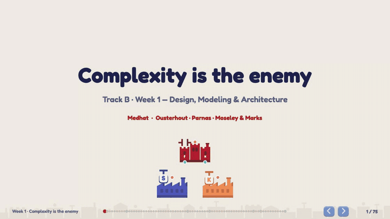

The look and the level structure follow *Word Factori*
(flat colour-coded factories on graph paper). Every shape is drawn procedurally with Pixi
Graphics. There are no bitmap assets, and nothing is taken from Word Factori or any other game.

---

## Examples

### 1 · A talk: “Complexity is the enemy” (Track B, week 1)

A 75-slide deck on *A Philosophy of Software Design* ch. 1–6, Parnas's *On the Criteria To Be
Used in Decomposing Systems into Modules* (1972) and Moseley & Marks' *Out of the Tar Pit*
(2006), with a short postscript on the Ousterhout ↔ Uncle Bob debate. Every quote was checked
word for word against the source texts when the deck was generated.

| Parnas's KWIC index: two modularizations, five likely changes | Unknown unknowns: the change that bites a card you didn't know about |
|---|---|
|  |  |
| **Classitis: an x-ray of Java's three stream objects vs Unix's five calls** | **Code with call arcs and hidden-state arcs (PrimeGenerator)** |
| 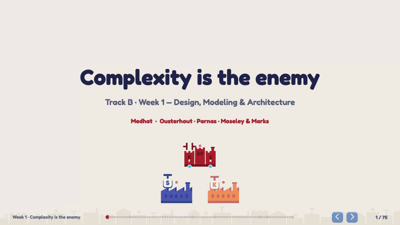 | 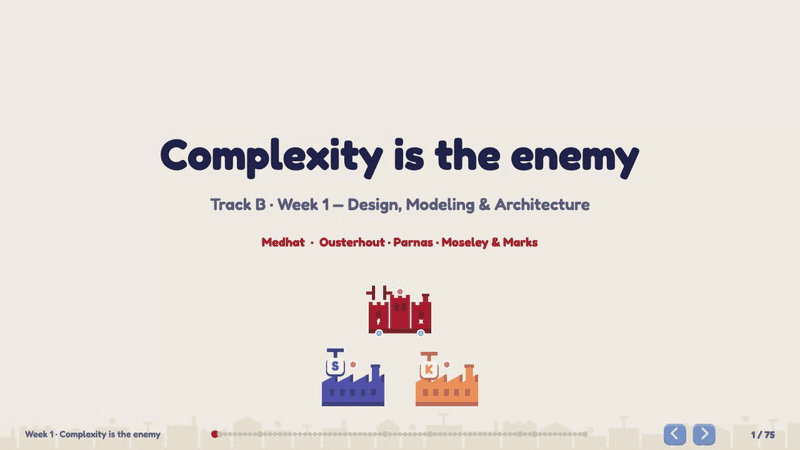 |

<table><tr>
<td>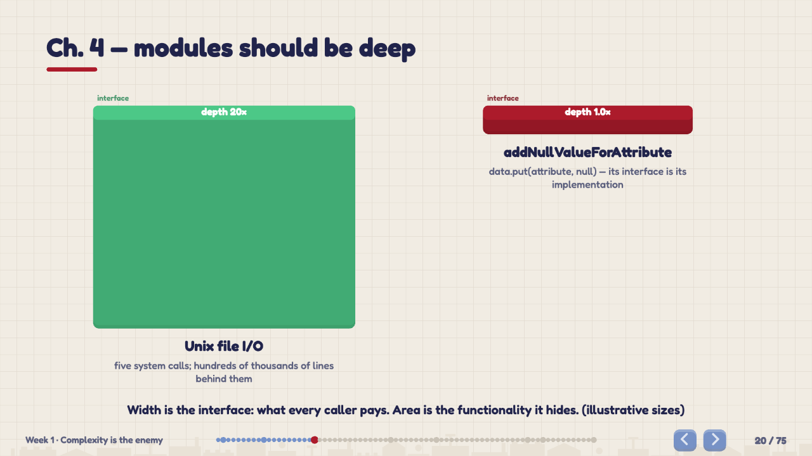</td>
<td>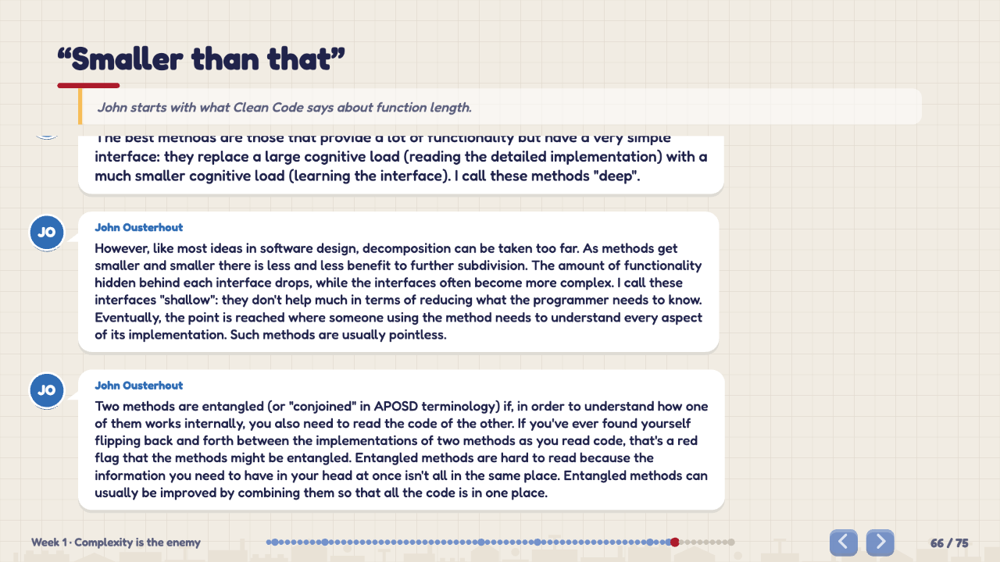</td>
<td>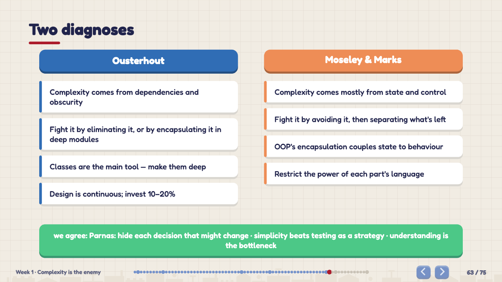</td>
</tr></table>

Videos (MP4): [assembly line](docs/media/line.mp4) · [Parnas](docs/media/parnas.mp4) ·
[unknown unknowns](docs/media/unknown.mp4) · [factory x-ray](docs/media/factory.mp4) ·
[code arcs](docs/media/code.mp4) · [FRP estate agency](docs/media/estate.mp4)

### 2 · A game: the combinator factory

Start with Schönfinkel's **S** and **K**. Wire factories that apply combinators to each other and
derive I, B, C, W and the rest of Smullyan's birds. Then go on to APL and BQN tacit trains, Church
booleans, and NAND gates up to a full adder: 46 levels in 6 worlds. Each level ends with the paper
that introduced the combinator and a real-world use of it. The **reduction theater** animates any
term step by step: S copies, K drops.

| Building KI = K(SKK) and running it | The theater: `S x y z → x z (y z)` |
|---|---|
| 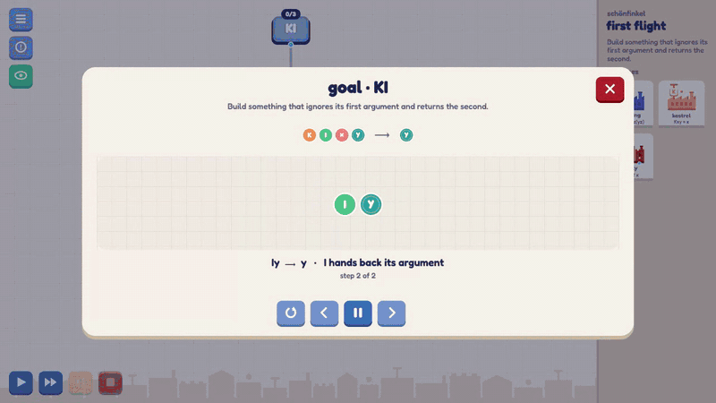 | 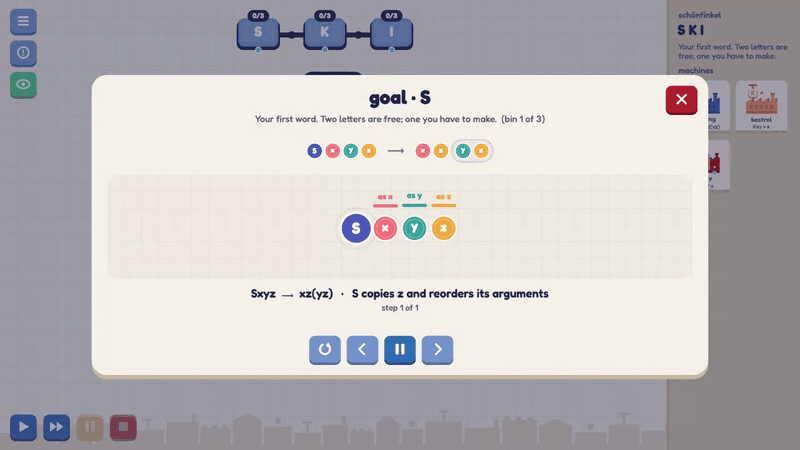 |

<table><tr>
<td>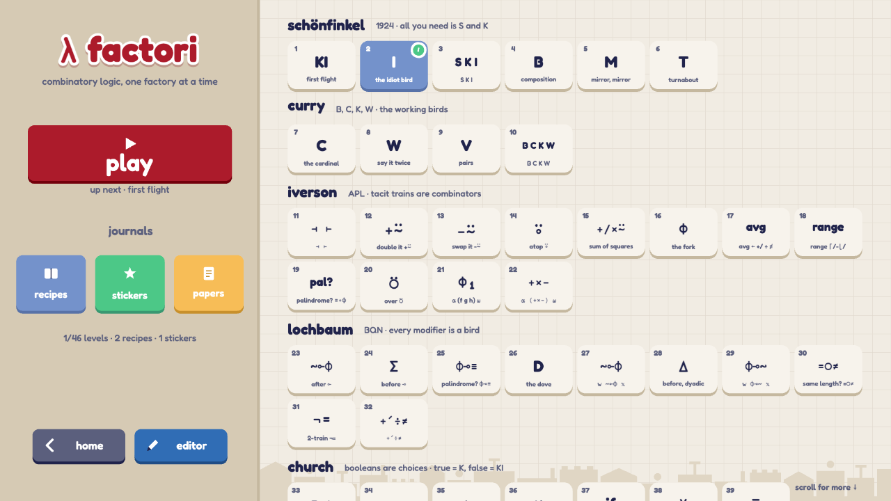</td>
<td>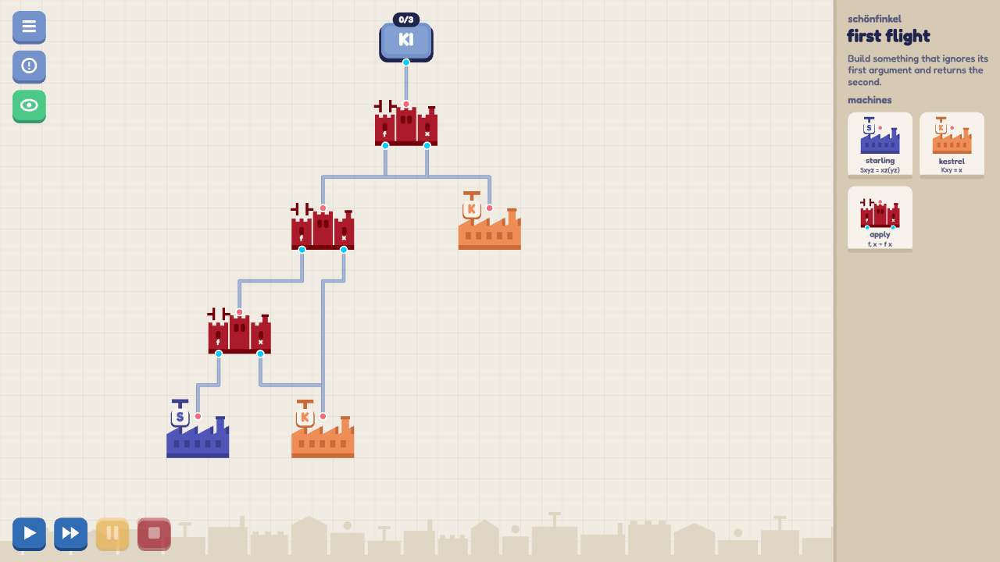</td>
</tr></table>

### 3 · Tools: level editor, slide editor and presenter

- **Level editor** (`#/editor`): define sources, bins and goals (a behaviour like `xy | y`, or a
  truth table). It can find the smallest recipe by brute-force search, playtest the level, and
  export or share it.
- **Slide editor**: press **E** on any slide to edit its JSON, with validation, live.
- **Presenter window**: press **P** for notes, the next slide and a timer. It stays in sync
  over a `BroadcastChannel`.

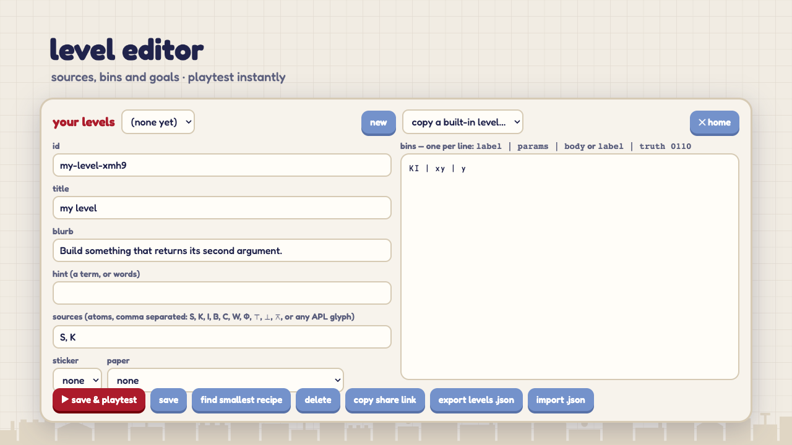

### 4 · The mechanics tour

One slide per mechanic. It's the quickest way to see what a deck can do:
[`public/decks/mechanics-tour.json`](public/decks/mechanics-tour.json).

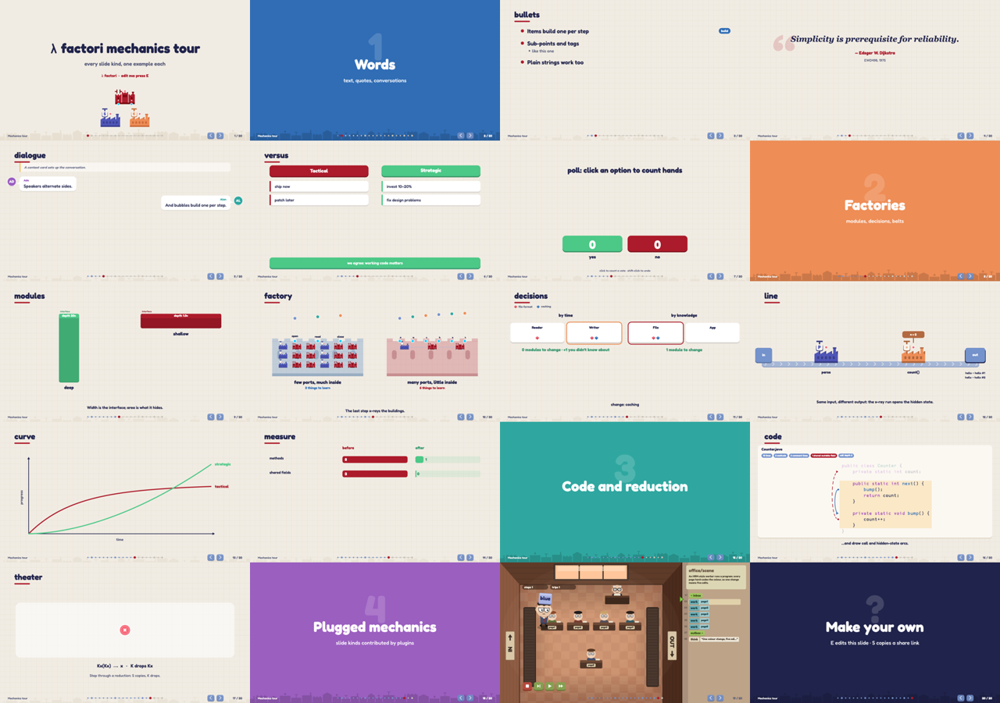

---

## Slide mechanics

A deck is plain JSON in `public/decks/<id>.json`, listed in `public/decks/index.json` and
validated with Effect `Schema`, so a typo gives a readable error instead of a crash. Each step
(→) advances the slide's own animation before moving to the next slide.

| kind | what it shows |
|---|---|
| `title`, `section`, `bullets`, `quote` | the basics; bullets build one per step |
| `dialogue` | a conversation in chat bubbles, with a context card |
| `versus` | two positions side by side, plus what both agree on |
| `code` | panes of code; steps highlight lines, zoom in, and draw **call arcs** and **hidden-state arcs** (Java-like code is analysed) |
| `modules` | Ousterhout's rectangles: interface width vs hidden functionality |
| `factory` | modules as buildings with ports; the last step **x-rays** them to show the machinery inside |
| `decisions` | Parnas's test: each step changes a design decision and counts the modules that must change. `secretly` gems are unknown unknowns |
| `line` | an assembly line: items ride a belt through machines. Hidden state sits behind padlocked gauges until an `xray` run |
| `curve` | tactical vs strategic progress over time |
| `measure` | before/after metrics |
| `theater` | a combinator reduction, step by step |
| `poll` | click to count hands |
| `office/scene` | *(plugin)* a Human Resource Machine-style worker running an office program |

A minimal `line` slide:

```json
{
  "kind": "line",
  "title": "Same input, different output",
  "machines": [
    { "name": "greet(name)", "icon": "g" },
    { "name": "getNextCounter()", "icon": "+", "state": "counter = 0" }
  ],
  "runs": [
    { "input": "Ann", "outputs": ["Hi Ann", "Hi Ann #1"], "states": ["", "counter = 1"] },
    { "input": "Ann", "outputs": ["Hi Ann", "Hi Ann #2"], "states": ["", "counter = 2"], "xray": true }
  ]
}
```

Deck keys: **→ / space** next · **←** back · **N** notes · **O** overview · **F** fullscreen ·
**P** presenter · **E** edit slide · **S** copy share link · **Esc** home.

## Plugins

The host knows nothing about combinators or slides. Everything you can open is a plugin, loaded
lazily and addressed by a hash route, `#/<plugin>/<path…>`:

```ts
import type { Plugin } from "./src/engine/Plugin.ts"

export const plugin: Plugin = {
  id: "hello", title: "hello", subtitle: "a minimal plugin", kind: "tool",
  color: 0x306db5, shade: 0x1f4c85,
  open: (host, path) => host.show(() => new HelloScene(host, path))
}
```

- **Built-in plugins** (`src/engine/registry.ts`): `combinators`, `editor`, `deck`.
- **Third-party plugins**: `#/plugin/<url>` loads an ES module whose default export is a `Plugin`.
- **Slide mechanics**: a plugin can contribute namespaced slide kinds (`<plugin>/<mechanic>`) with
  `registerMechanics` (`src/engine/mechanics.ts`). They are preloaded before a deck opens, so
  rendering stays synchronous. The `office` plugin is the example: `office/scene`.

## Sharing, without a backend

- **Share links**: `#/open/<pack>` holds a whole deck or level pack in the URL (deflate-raw +
  base64url). Press **S** in a deck, or use “copy share link” in the editor.
- **Hosted packs**: `#/import/<url>` opens a deck or level JSON from anywhere.
- **Community registries**: `public/registry.json` and any registry URL added from the home screen
  list decks, levels and plugins. A registry is just a JSON file.

## Performance

- **Render on demand.** A frame is drawn only while tweens run, while the scene animates, after
  input or a resize, plus a 4 Hz idle heartbeat. A static slide draws about 12 frames in 3 s
  instead of 180, and animated slides still run at 60 fps.
- **Parallel startup.** Fonts are preloaded from `index.html`. The route's plugin chunk and deck
  JSON start downloading before the renderer initializes.
- **No stencil mask.** Letterbox bars replace a root mask that cost a stencil pass per frame.
- **Lazy everything.** Each plugin and each plugin mechanic is its own chunk.

`scripts/drive.ts` is the headless Playwright tester used to measure all of this. `THROTTLE=4`
emulates a slower CPU, `LATENCY=80` adds network round-trip time, and `VIDEO=<dir>` records the
run (that is how the media in this README was made).

## Development

```sh
pnpm install
pnpm dev          # http://localhost:5173
pnpm test         # vitest: reduction, sim, levels, decks (every code step, line and change map)
pnpm typecheck
pnpm build        # BASE=/sub/path/ for a subpath deploy
pnpm search Ψ S,K,B,C,W,I 8          # brute-force recipe search for level design
pnpm drive '[{"shot":"home"}]'       # headless play-tester (1920×1080 design coordinates)
```

Stack: TypeScript, [PixiJS 8](https://pixijs.com), [Effect 4](https://effect.website) (services,
`Schema`, layers), Vite, Vitest, Playwright.

```
src/core      pure logic: terms, reduction, traces, board, sim, levels, recipe search (no Pixi/DOM)
src/game      Effect services: levels, progress, decks, events, storage
src/engine    host (stage, router, render loop), plugin contract, home screen, sharing
src/render    shared procedural art, UI, tweens, the reduction theater, game scenes
src/plugins   combinators · editor · deck (schema, slide mechanics, editor, presenter) · office
public/decks  decks as data
```

## Credits

- Visual language inspired by *Word Factori* (Star Garden Games). The office mechanic is
  inspired by *Human Resource Machine* (Tomorrow Corporation). All art here is redrawn
  procedurally. This project is not affiliated with either game.
- Fonts: [Fredoka](https://fonts.google.com/specimen/Fredoka) (SIL OFL) and
  [BQN386](https://github.com/dzaima/BQN386) (Unlicense, `public/fonts/BQN386-LICENSE.txt`).
- The Week 1 deck quotes John Ousterhout's *A Philosophy of Software Design* (2nd ed.),
  D. L. Parnas (CACM, 1972), Moseley & Marks (2006), the Stanford CS190 lecture notes, and the
  [Ousterhout–Martin discussion](https://github.com/johnousterhout/aposd-vs-clean-code). Quotes
  are short excerpts with attribution, for commentary and teaching. Read the originals.

## License

MIT (see [LICENSE](LICENSE)). The licence covers the code. Quoted texts belong to their authors.
